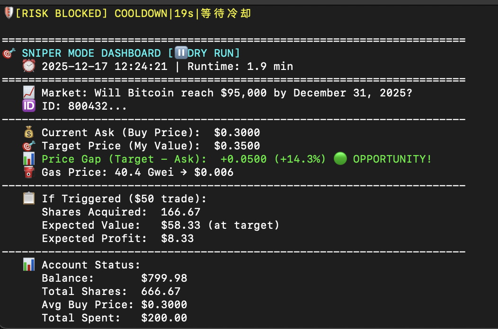
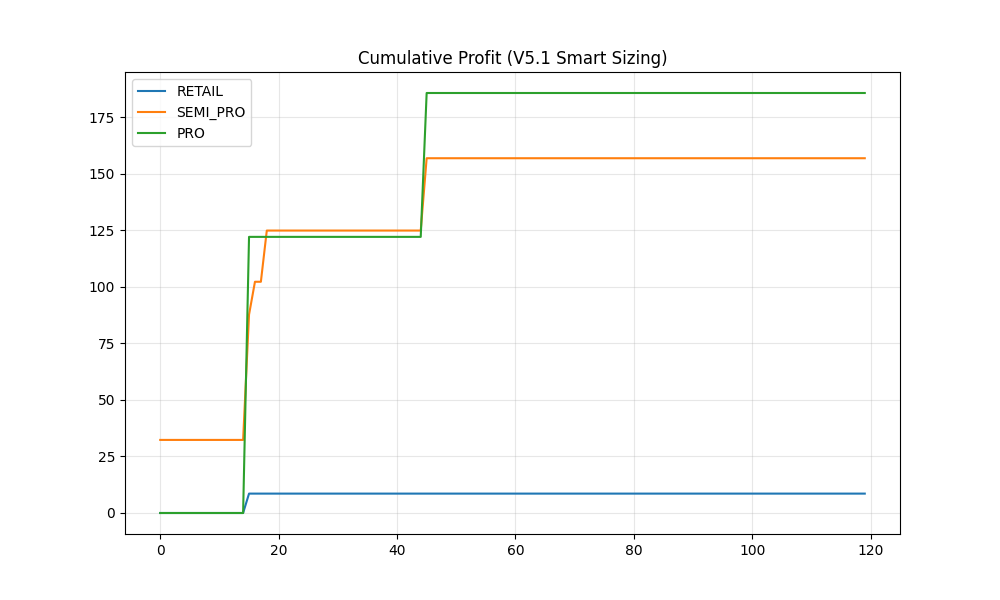
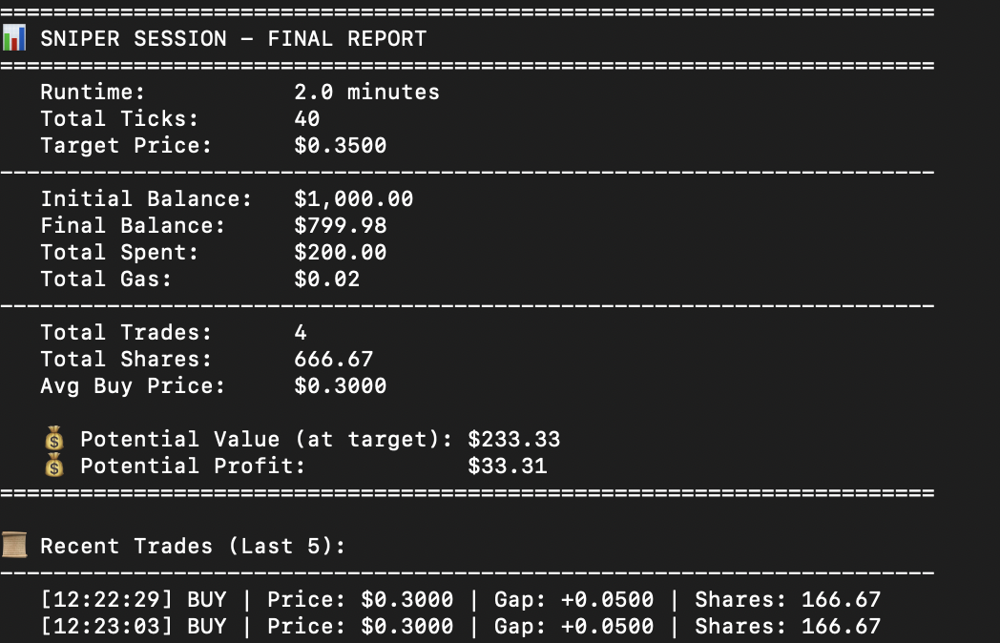

# PolySniper: Prediction Market Arbitrage Bot 🎯

A production-grade, event-driven arbitrage bot designed for **Polymarket** on the Polygon network. Built with Python and Web3.py, featuring real-time opportunity detection, atomic execution simulation, and strict risk management protocols.

## 🚀 Key Features

* **Sniper Strategy (`paper.py`)**: Real-time monitoring of "Taker" opportunities based on user-defined valuation models.
* **Execution Engine (`trade_executor.py`)**:
    * **Modular Design**: Decoupled strategy logic from on-chain interaction.
    * **Dual Modes**: Supports safe `Dry-Run` simulation and `Live` mainnet execution.
    * **Gas Optimization**: Dynamic gas estimation compliant with EIP-1559.
* **Market Radar (`local.py`)**: Tools for scanning high-liquidity markets and backtesting strategies against historical tick data.
* **Risk Control System**:
    * **Cooldown Mechanism**: Prevents API rate-limiting and "machine-gun" execution.
    * **Position Sizing**: Hard caps on total capital exposure per market.

## 🛠 Tech Stack

* **Language**: Python 3.9+
* **Blockchain**: Web3.py (Direct RPC interaction, Raw Transaction management)
* **Data Analysis**: Pandas, NumPy (OU Process Simulation)
* **Network**: Polygon Mainnet

## ⚡️ Quick Start

1.  **Clone the repository**
    ```bash
    git clone [https://github.com/YourUsername/PolySniper.git](https://github.com/YourUsername/PolySniper.git)
    cd PolySniper
    ```

2.  **Install dependencies**
    ```bash
    pip install -r requirements.txt
    ```

3.  **Configure Environment**
    Copy the example configuration file:
    ```bash
    cp .env.example .env
    ```
    Then edit `.env` to add your **testnet/burner wallet** credentials.
    
    > **⚠️ Security Note:** The project is configured to ignore the `.env` file to prevent accidental leakage. Please ensure you are using a **virtual/testing private key** with limited funds, not your primary storage wallet.

4.  **Run Sniper Mode (Dry Run)**
    ```bash
    python paper.py
    ```

## ⚠️ Disclaimer

This software is for educational purposes only. Cryptocurrency trading involves high risk. Use at your own risk.

## 🗺️ Roadmap (V2.0 Development Plan)

Current Status: **Stable V1.0 (Single-Market Focus)**

To ensure system stability and strict nonce management, V1 utilizes a synchronous architecture. The following features are architected for the upcoming V2 release:

* **⚡️ Asyncio Concurrency Engine**: Migrate from `requests` to `aiohttp` to support monitoring 50+ markets simultaneously without blocking.
* **🔄 Auto-Redemption Module**: Integrate with Conditional Token Framework (CTF) to automatically redeem winning shares after market resolution.
* **🤖 Telegram/Discord Integration**: Real-time alerts for trade execution and gas spikes.
* **🔐 Vault Security**: Upgrade private key management to use AWS KMS or HashiCorp Vault for enterprise-grade security.

## 🖥️ Live Sniper Dashboard
The bot features a real-time CLI dashboard for monitoring price gaps, gas fees, and risk status.

> **Key Feature Highlight:** Note the **`[RISK BLOCKED]`** alert in the screenshot below. This demonstrates the **Automated Risk Management** module triggering a cool-down period to prevent over-trading during volatility.



---

## 📊 Performance Backtest (Simulation)

I validated the **Ornstein-Uhlenbeck (OU)** strategy against Retail logic over 120 trade sequences.

### 1. Cumulative Profit Curve
**PRO Strategy (Green)** vs. Retail Strategy (Blue).
The Pro strategy stabilizes profits by filtering low-quality signals and avoiding front-running.


### 2. Execution Metrics
Comparison of Win Rate and Net Profit between Retail, Semi-Pro, and Pro modes.

